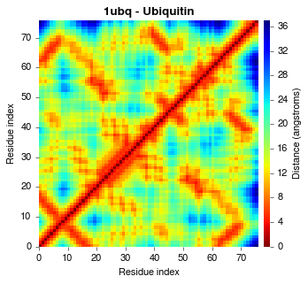

PConPy—a Python module for generating 2D protein maps
=====================================================




This is the official repository for the redevelopment of PConPy, previously
published as:

- H. Ho, M. Kuiper and R. Kotagiri, "PConPy--a Python module for generating 2D
  protein maps", _Bioinformatics_, vol. 24, no. 24, pp. 2934-2935, 2008.  
  ([article](dx.doi.org/10.1093/bioinformatics/btn566))

The original (now deprecated) source code associated with the article is
accessible from the [`legacy`](https://github.com/kianho/pconpy/tree/legacy)
branch of this repository.

## Current status
### March 6, 2015

- Distance and contact maps can be generated using only the CA-CA distance
  measure. The remaining measures are still in development.

- Hydrogen bond maps can be generated. 

## Usage examples
```
# Generate a contact map from chain A of 1ubq.pdb using the CA-CA distance  
# measure at an 8 angstrom contact threshold, rendered as a PDF file.
python ./pconpy/pconpy.py cmap 8.0 --pdb 1ubq.pdb -c A --output 1ubqA_cmap.pdf --measure CA 


# Generate a distance map from chains A and B of 1mtp.pdb using the CA-CA  
# distance measure, rendered as a PNG file.
python ./pconpy/pconpy.py dmap --pdb 1mtp.pdb -c A --output 1mtpAB_dmap.png --measure CA 


# Generate a hydrogen bond matrix from chain A of 1ubq.pdb, saving it  
# to a plain text file (for use in an existing pipeline).
python ./pconpy/pconpy.py hbmap --pdb 1ubq.pdb -c A --plaintext --output 1ubq.txt
```

## About

A [_contact map_](http://en.wikipedia.org/wiki/Protein_contact_map) is a 2D
representation of protein structure that illustrates the presence or absence of
contacts between individual amino acids. This enables the rapid visual
exploratory data analysis of structural features without 3D rendering software.
Additionally, the underlying 2D matrix of a contact map, known as a _contact
matrix_, can naturally be used as numeric input in subsequent automated
knowledge discovery or machine learning tasks. PConPy generates
publication-quality renderings of contact maps, and the related distance- and
hydrogen bond maps.


## Who's using PConPy?

- B. Konopka, M. Ciombor, M. Kurczynska and M. Kotulska, "Automated
  Procedure for Contact-Map-Based Protein Structure Reconstruction", The
  _Journal of Membrane Biology_, vol. 247, no. 5, pp. 409-420, 2014.  
  ([article](dx.doi.org/10.1186/1471-2105-10-153))

- A. Stivala, A. Wirth and P. Stuckey, "Tableau-based protein
  substructure search using quadratic programming", _BMC Bioinformatics_, vol.
  10, no. 1, p. 153, 2009.  
  ([article](dx.doi.org/10.1007/s00232-014-9648-x))


## Useful links

- Peter Cock's (@peterjc) [tutorial](http://goo.gl/q7DNt7) covers the
  basics of PDB file parsing and visualisation using the powerful
  [Biopython](http://biopython.org) library.
